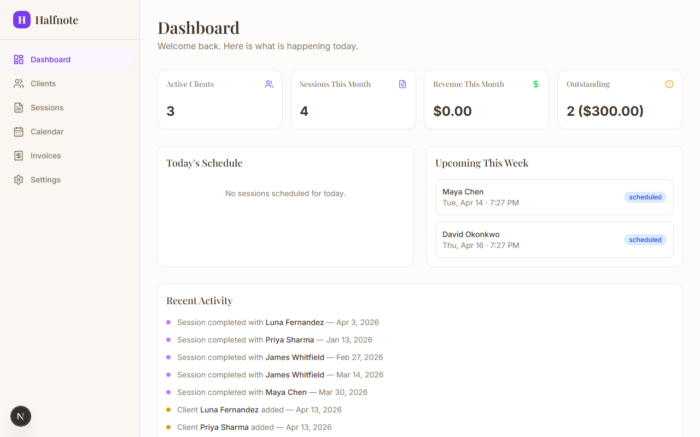
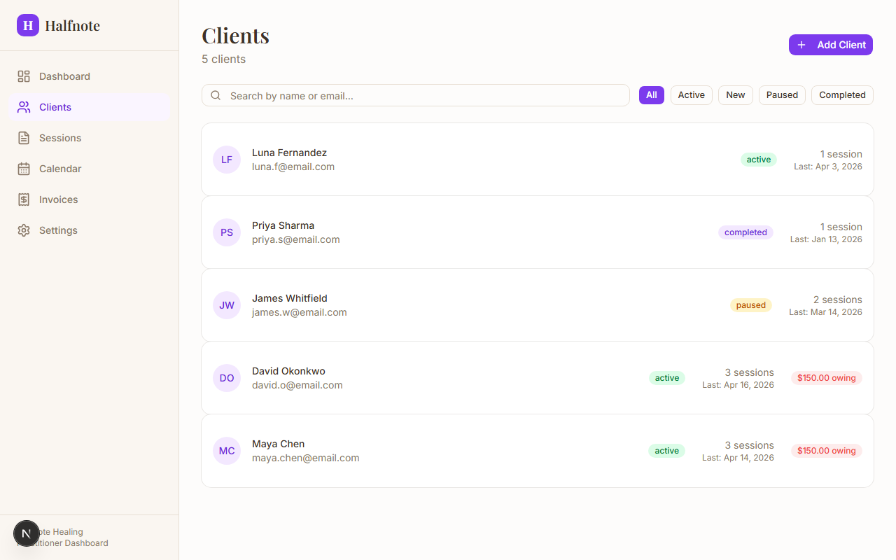
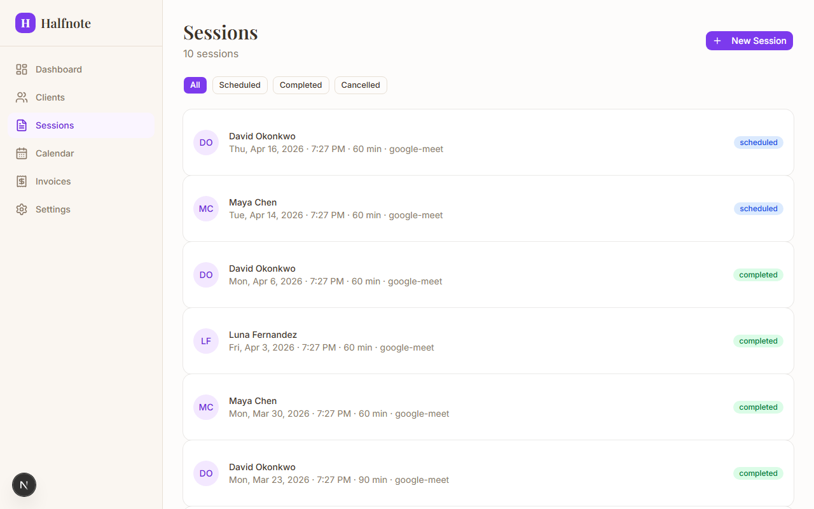
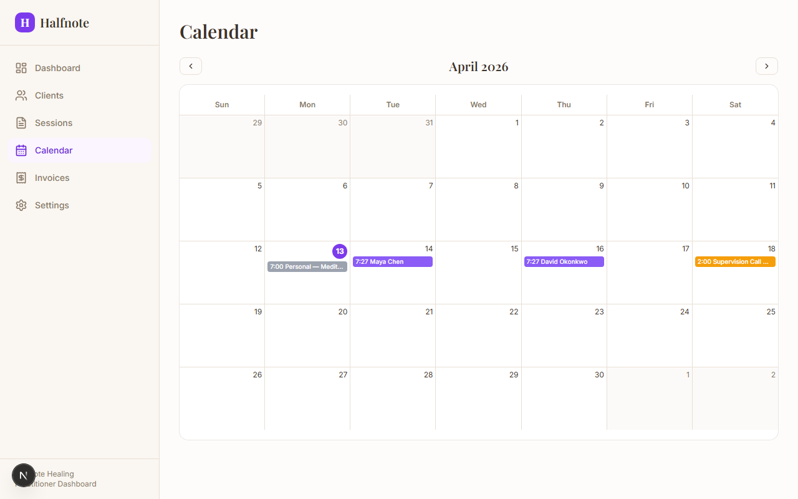
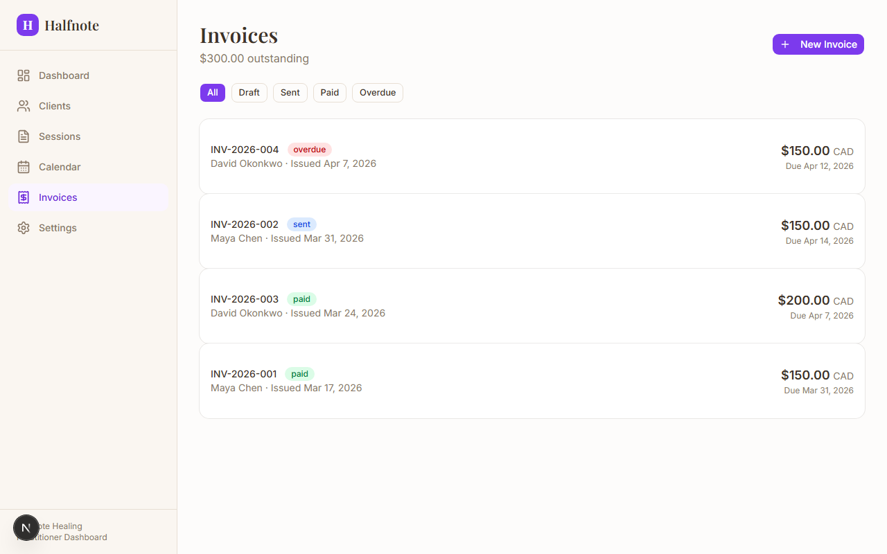
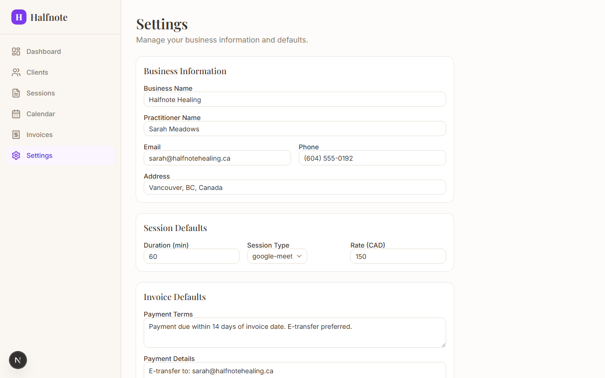
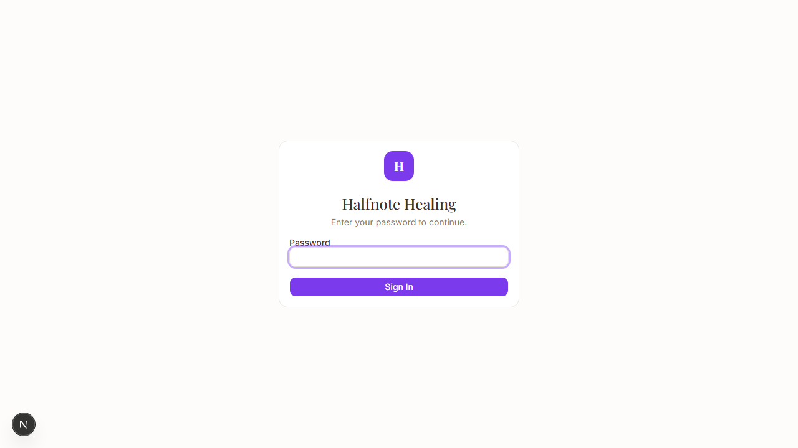

# Halfnote Healing — Practitioner Dashboard

A private client management dashboard for a solo spiritual healing practitioner. Manages clients, session history, scheduling, notes, invoicing, and AI-powered session summaries.

Built with **Next.js 16**, **SQLite/Prisma**, **shadcn/ui**, and **Anthropic Claude API**.

---

## Screenshots

### Dashboard


### Clients


### Sessions


### Calendar


### Invoices


### Settings


### Login


---

## Features

- **Client CRM** — searchable/filterable client list, intake notes, session history, invoice tracking
- **Session Management** — auto-saving notes editor, transcript paste, follow-up actions, status management
- **AI Summaries** — Claude-powered session summaries and client journey recaps
- **Calendar** — monthly grid view with color-coded events
- **Invoicing** — create, track, and print invoices with status workflow (draft > sent > paid)
- **Settings** — business info, session defaults, payment details

## Tech Stack

- Next.js 16 (App Router, React Server Components)
- SQLite via Prisma ORM
- Tailwind CSS + shadcn/ui
- Anthropic Claude API (session summaries + client recaps)
- Simple cookie-based auth (single-user prototype)

## Getting Started

```bash
git clone https://github.com/vellumagit/halfnote-app.git
cd halfnote-app
npm install
npx prisma generate
npx prisma migrate dev
npx prisma db seed
npm run dev
```

Open [http://localhost:3000](http://localhost:3000) — password: `halfnote2026`

### Environment Variables

Create a `.env` file:

```env
DATABASE_URL="file:./dev.db"
ANTHROPIC_API_KEY="sk-ant-..."   # optional, for AI features
ADMIN_PASSWORD="halfnote2026"
```
